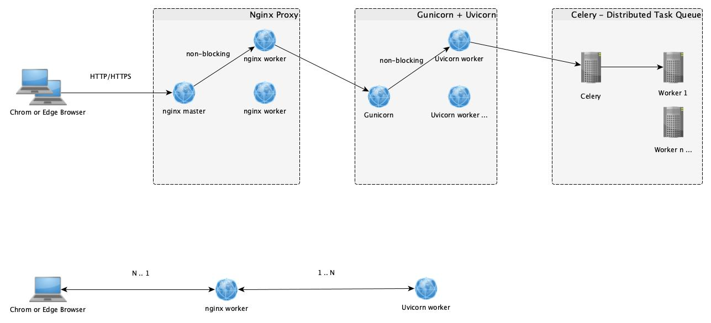

# microservices-python
A rapid development framework for exporting python code as microservices, supporting distributed asynchronous task queues

## Architecture Diagram

## License check for commercial apps

| Component       | Description                  | License      |
| --------------- | ---------------------------- | ------------ |
| Celery          | Celery is a simple, flexible, and reliable distributed system to process vast amounts of messages, while providing operations with the tools required to maintain such a system.    | BSD License  |
| Gunicorn        | Gunicorn 'Green Unicorn' is a Python WSGI HTTP Server for UNIX.                                            | MIT License  |
| Uvicorn         | Uvicorn is an ASGI web server implementation for Python.                                          | BSD-3-Clause license |
| Nginx           | nginx [engine x] is an HTTP and reverse proxy server.                                          | BSD-2-Clause license |

> Conclusion: No any payment for commercial apps
