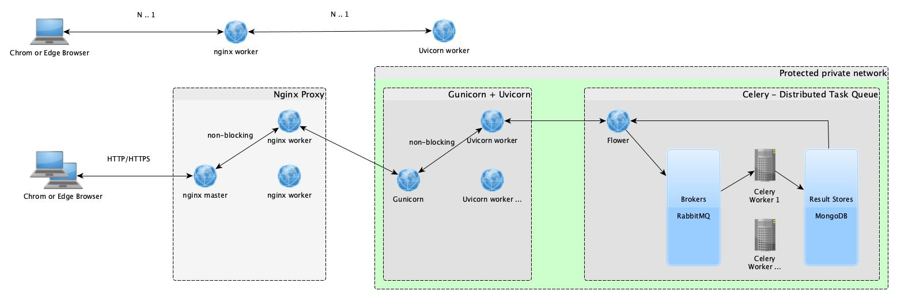

# Microservices development framework for python
A rapid development framework for exporting python code as microservices, supporting distributed asynchronous task queues

## Python version requirements
Python ❨3.8, 3.9, 3.10, 3.11❩

## Basic architecture 


## License check for major components

| Component       | Description                  | License      |
| --------------- | ---------------------------- | ------------ |
| Celery          | Celery is a simple, flexible, and reliable distributed system to process vast amounts of messages, while providing operations with the tools required to maintain such a system.    | BSD License  |
| Gunicorn        | Gunicorn 'Green Unicorn' is a Python WSGI HTTP Server for UNIX.                                            | MIT License  |
| Uvicorn         | Uvicorn is an ASGI web server implementation for Python.                                          | BSD-3-Clause license |
| Nginx           | nginx [engine x] is an HTTP and reverse proxy server.                                          | BSD-2-Clause license |


> Conclusion: No any payment is required for commercial apps

## How to start the development environment
``` bash shell
$ mkdir -p runtime/logs

# Prepare the basic python environment
$ virtualenv -p python3 python3_env
$ source python3_env/bin/activate
$ pip install -r ./requirements.txt

# Execute the following command lines in separate shell Windows
$ make dev-up
$ make flower-up
$ make worker1-run
$ make uvicorn-run
```


